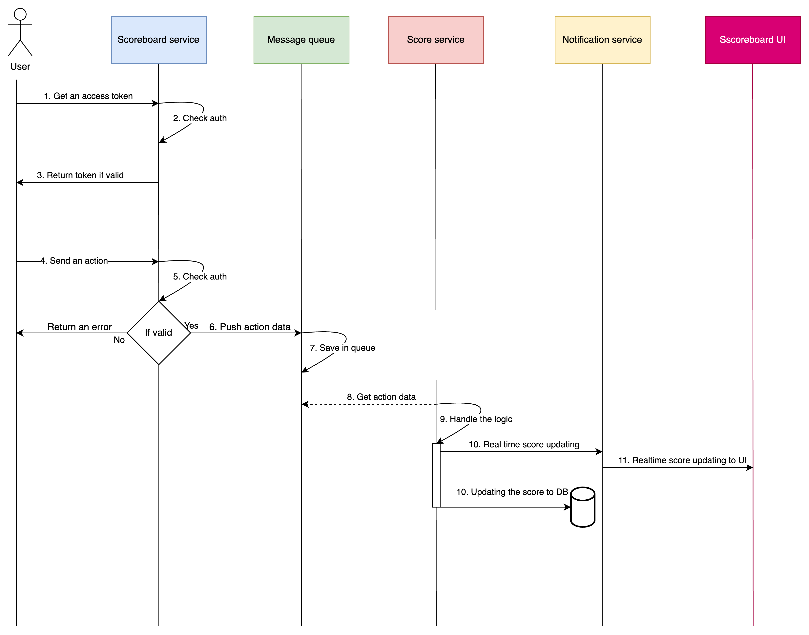

1. Overview Architecture

We use Kubernetes (K8s) to manage and deploy our system, handling scaling, monitoring, and deployment efficiently. For real-time score updates affecting millions of users, we rely on message queue brokers such as RabbitMQ and Kafka.

For push notifications, we can use WebSockets, Firebase Cloud Messaging (FCM), or Redis Pub/Sub depending on the use case.

Key Components:
- Scoreboard Service:

    - Manages APIs, authentication, and authorization (using either JWT tokens or OAuth2).
    - Handles additional business logic related to score processing.

- Score Service:
    - Consumes messages from the queue and processes score updates.
    - Updates the database and sends real-time notifications to the frontend.

- Realtime Notification Service:
    - Sends notifications to update score changes in the UI.

- Message Queue Module (RabbitMQ/Kafka):
    - Stores score-related events for the Score Service to process.

- Database (MongoDB/PostgreSQL)
    - Permanently stores user information and other related data.

2. The workflow 

3. Notes:
- When updating scores in the database, we need to be mindful of potential bottlenecks caused by high-frequency updates. To optimize performance and reduce database load, we can implement batch updates instead of processing each update individually.